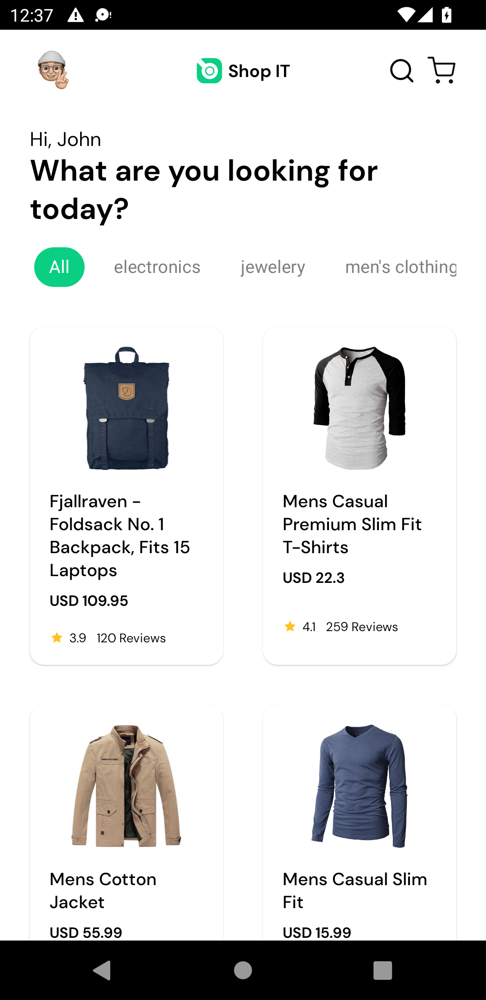
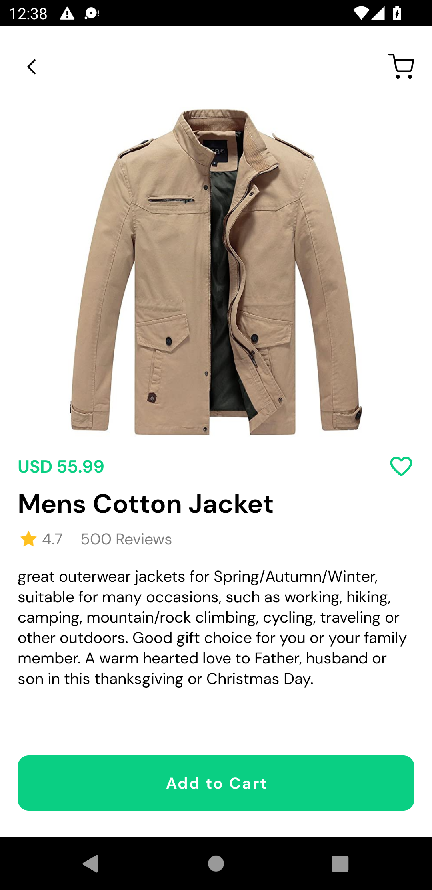
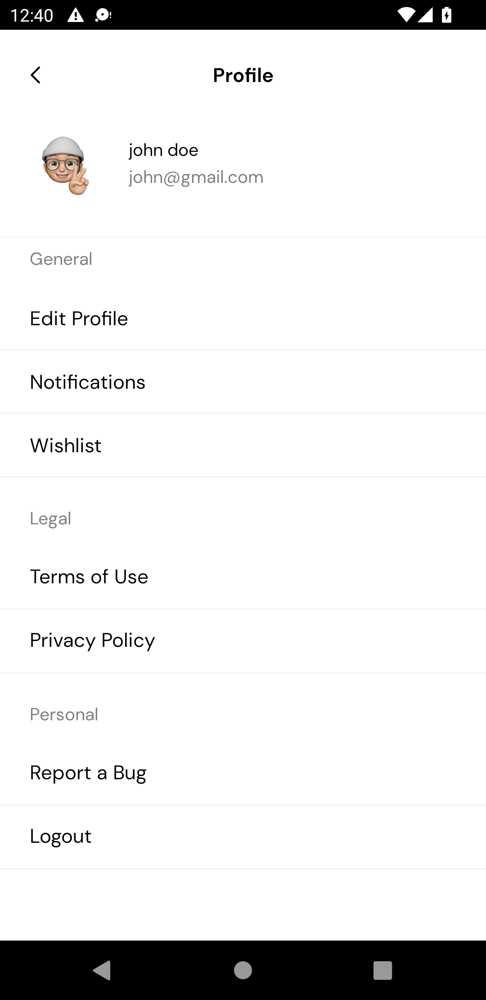
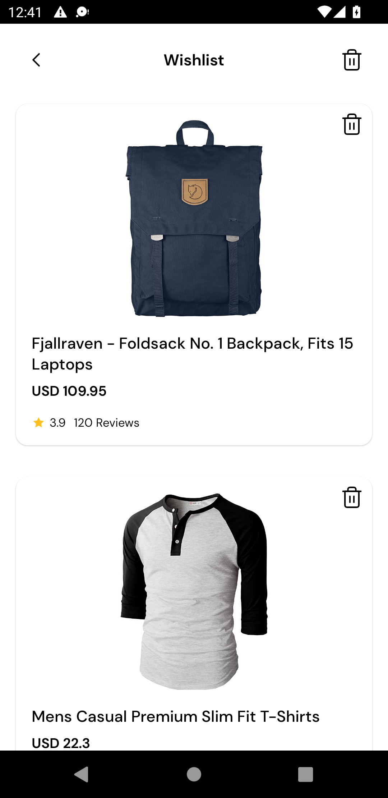
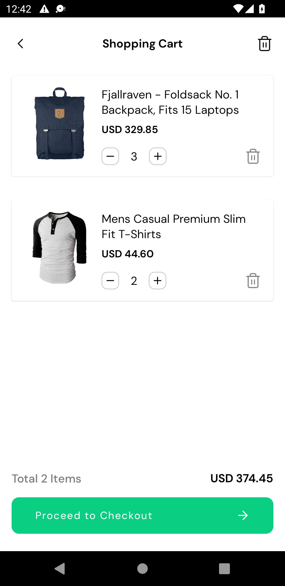
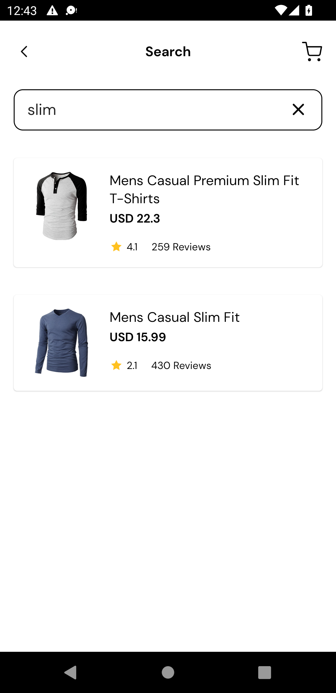
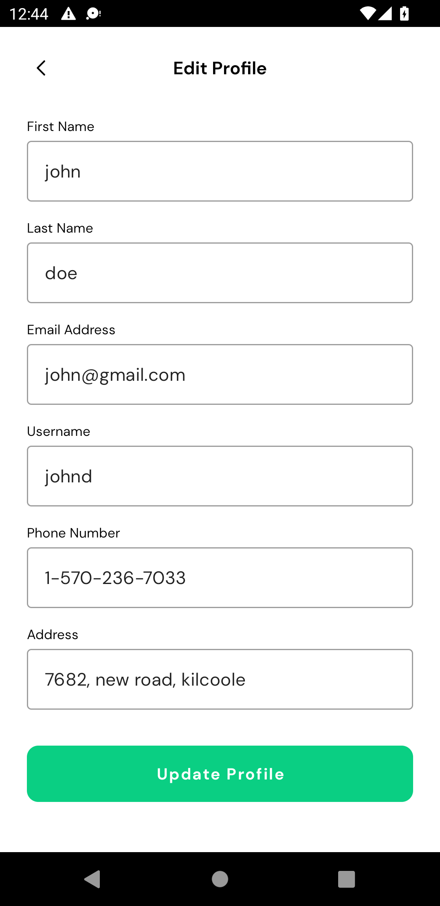
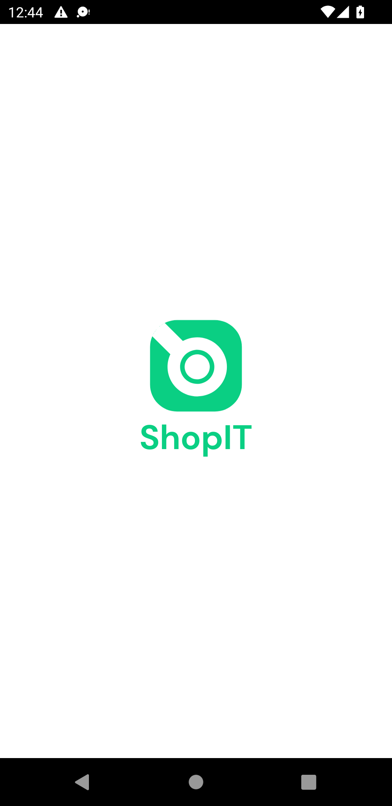
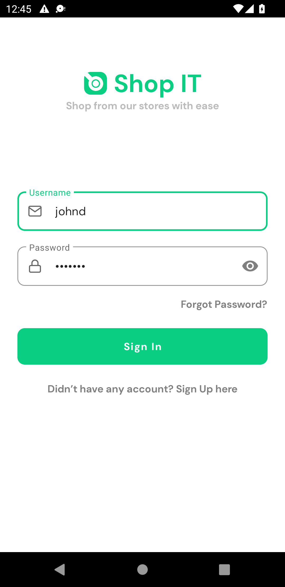

# Shop IT 🛒
Android shopping app built with MVVM Clean Architecture consuming [FAKE STORE API](https://fakestoreapi.com/)

## ScreenShots

Product Screen             | Product Detail Screen     | Profile Screen
:-------------------------:|:-------------------------:|:-------------------------:
            |    |   |

WishList Screen            | Cart Screen               | Search Screen
:-------------------------:|:-------------------------:|:-------------------------:
           |                |   |

Edit Profile Screen            | Splash Screen               | Login Screen
:-------------------------:|:-------------------------:|:-------------------------:
           |                |   |

## Tech Stack
- [Kotlin](https://developer.android.com/kotlin) - Kotlin is a programming language that can run on JVM. Google has announced Kotlin as one of its officially supported programming languages in Android Studio; and the Android community is migrating at a pace from Java to Kotlin.
- [Android KTX](https://developer.android.com/kotlin/ktx.html) - Android KTX is a set of Kotlin extensions that are included with Android Jetpack and other Android libraries. KTX extensions provide concise, idiomatic Kotlin to Jetpack, Android platform, and other APIs.
- [AndroidX](https://developer.android.com/jetpack/androidx) - Major improvement to the original Android [Support Library](https://developer.android.com/topic/libraries/support-library/index), which is no longer maintained.
- [Lifecycle](https://developer.android.com/topic/libraries/architecture/lifecycle) - Lifecycle-aware components perform actions in response to a change in the lifecycle status of another component, such as activities and fragments. These components help you produce better-organized, and often lighter-weight code, that is easier to maintain.
- [ViewModel](https://developer.android.com/topic/libraries/architecture/viewmodel) -The ViewModel class is designed to store and manage UI-related data in a lifecycle conscious way.
- [Room database](https://developer.android.com/training/data-storage/room) - The Room persistence library provides an abstraction layer over SQLite to allow fluent database access while harnessing the full power of SQLite.
- [Kotlin Coroutines](https://developer.android.com/kotlin/coroutines) - A concurrency design pattern that you can use on Android to simplify code that executes asynchronously.
- [Retrofit](https://square.github.io/retrofit) -  Retrofit is a REST client for Java/ Kotlin and Android by Square inc under Apache 2.0 license. Its a simple network library that is used for network transactions. By using this library we can seamlessly capture JSON response from web service/web API.
- [GSON](https://github.com/square/gson) - JSON Parser,used to parse requests on the data layer for Entities and understands Kotlin non-nullable and default parameters.
- [Kotlin Flow](https://developer.android.com/kotlin/flow) - In coroutines, a flow is a type that can emit multiple values sequentially, as opposed to suspend functions that return only a single value.
- [Dagger Hilt](https://developer.android.com/training/dependency-injection/hilt-android) - A dependency injection library for Android that reduces the boilerplate of doing manual dependency injection in your project.
- [Logging Interceptor](https://github.com/square/okhttp/blob/master/okhttp-logging-interceptor/README.md) -  logs HTTP request and response data.
- [Glide](https://github.com/bumptech/glide) - Glide is a fast and efficient open source media management and image loading framework for Android that wraps media decoding, memory and disk caching, and resource pooling into a simple and easy to use interface.

## Installation
1. Download the file or clone the repo and
2. Open it in Android Studio

### Note
This is not a production ready shopping application

## Architecture and Design
I used Model View View-Model (MVVM), repository pattern, and clean architecture. I used all 3 together to achieve a more structured code and less tight coupling between components. At a high level, I have 3 layers in the project which I have implemented as packages, all in one module. These layers include:
1. `Data Layer:` Responsible for getting data from any source, whether the local source or remote source. For this project, I implemented the remote data source [FAKE STORE API](https://fakestoreapi.com/) with Retrofit and the local data source with ROOM Database
2. `Domain layer:` Houses the core business logic of the app, interacting with the data layer via an abstraction (Repository Interface), afterward returning data to the UI layer.
3. `Presentation layer:` Responsible for displaying content on the screen. The View-Model in this layer is responsible for interacting with the domain layer via a use-case class to send and retrieve data, based on user actions.

## Improvements
1. Unit Test: A higher test coverage would be nice to have
2. Pagination: Need to add pagination.

Feel free to contribute to this project ):

## Credits
- [Harum Shidiqi](http://be.net/harumshidiqi) - UI inspiration came from this beautiful Behance project

